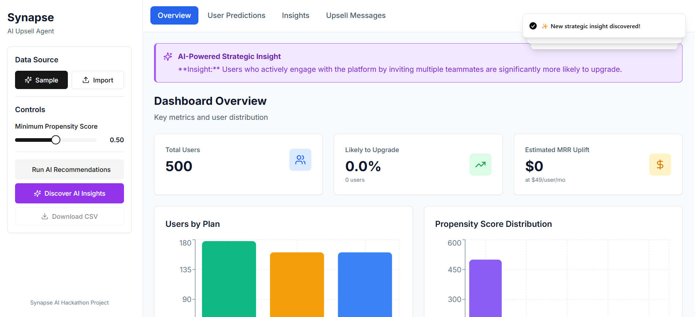
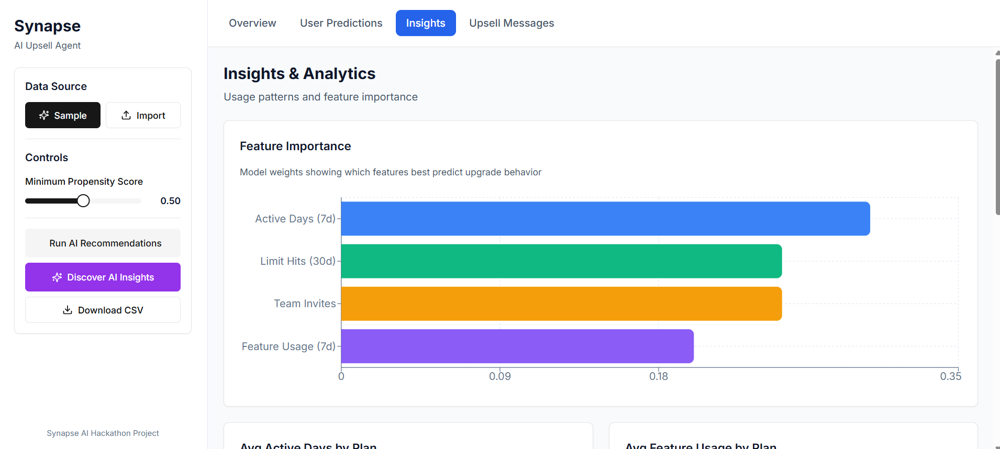
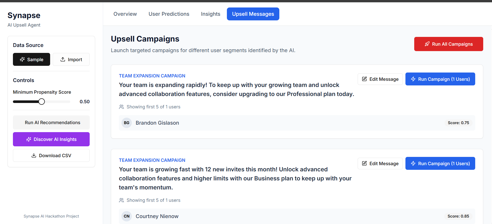

**🔗 Agent Deployment Link:** [https://saas-analytics-iota.vercel.app/](https://saas-analytics-iota.vercel.app/)

---

## 💡 Overview

**Synapse** is a strategic AI platform built for a hackathon, designed to solve one of the biggest challenges in the Freemium SaaS model — the **“leaky bucket.”**  
It empowers product managers by transforming **raw user behavior data** into **actionable, revenue-generating campaigns.**

Instead of relying on generic marketing, Synapse uses AI to determine:
- **Who** is ready to upgrade  
- **Why** they’re ready  
- **When** to execute the upsell
- 






---

## ✨ Core Features

Synapse is more than just an automation script — it’s a complete, **human-in-the-loop AI command center.**

### 🧭 Unified Command Center
A clean, intuitive dashboard where a Product Manager can import user data (via CSV or sample generation) and manage the entire upsell process.

### 🧠 Strategic AI Insights (`Discover AI Insights`)
The AI agent acts as a **data scientist**, analyzing user cohorts to uncover **hidden behavioral patterns** that correlate with upgrades — providing a **data-driven strategy** for campaigns.

### ⚙️ Operational AI Analysis (`Run AI Recommendations`)
Applies the discovered strategy to each user, generating:
- `propensityScore`
- `recommendationMessage`
- `AI_reason` (an explainable insight into the prediction)

### 🎯 Targeted Campaign Management
Automatically segments users into **campaign categories** based on AI recommendations.  
Product managers can review, edit campaign messages, and launch them in bulk.

### 🤖 Intelligent Automation (via n8n)
Executes campaigns through a **robust automation workflow** capable of performing different actions based on user data —  
for example, **sending personalized emails** via Gmail.

---

## 🚀 Tech Stack

| Layer | Technologies |
|--------|---------------|
| **Frontend** | Next.js, React, Tailwind CSS, Shadcn UI, Recharts |
| **Backend & AI** | Next.js API Routes, Google Gemini AI (`gemini-2.5-flash`) |
| **Automation / Orchestration** | [n8n.cloud](https://n8n.cloud) |
| **Deployment** | [Vercel](https://vercel.com) |

---

## ⚙️ Architecture Overview

The platform operates in a clear, four-phase flow — from **raw data** to **executed campaigns**:

1. **Data Input**  
   Product Managers load user data into the dashboard, either through the **sample generator** or by importing a **real CSV file**.

2. **AI Strategy Generation (`Discover AI Insights`)**  
   User cohorts are sent to the backend, where **Gemini AI** performs strategic analysis and returns **key behavioral insights**.

3. **AI Operational Analysis (`Run AI Recommendations`)**  
   Each user is analyzed by Gemini AI to produce:
   - a personalized score  
   - a reasoning explanation  
   - and an upgrade recommendation message.

4. **Campaign Execution**  
   When launched, campaign data is securely sent to an **n8n webhook** through a **Next.js proxy API route.**  
   The **n8n workflow** then executes intelligent routing and performs the final action (e.g., sending a personalized email).

---

## 🛠️ Run Locally

### **Prerequisites**
- Node.js (v18 or later)
- npm or yarn

---

### **Installation & Setup**

1. **Clone the repository**
   ```bash
   git clone https://github.com/Raahim2/saas-analytics.git
   cd saas-analytics
   ```

2. **Install dependencies**
   ```bash
   npm install
   ```

3. **Set up environment variables**
   Create a `.env.local` file in the project root and add:
   ```bash
   GEMINI_API_KEY=your_google_gemini_api_key_here
   N8N_WEBHOOK_URL=your_n8n_production_webhook_url_here
   ```

4. **Run the development server**
   ```bash
   npm run dev
   ```

5. **View in browser**
   Open [http://localhost:3000](http://localhost:3000)

---

## 👥 Team

### **Byte Forge**
- **Arshad Shaikh**

---

## 🧩 License

This project is licensed under the **MIT License**.

---

> _Built with strategy, intelligence, and purpose — **Synapse:** Where SaaS Growth Meets Smart AI._
